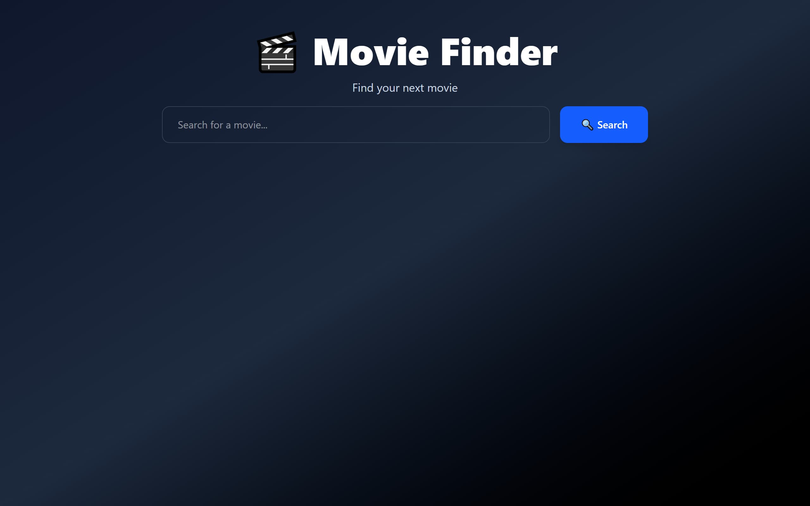
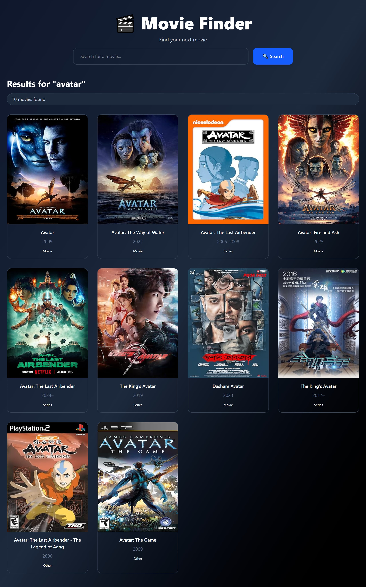
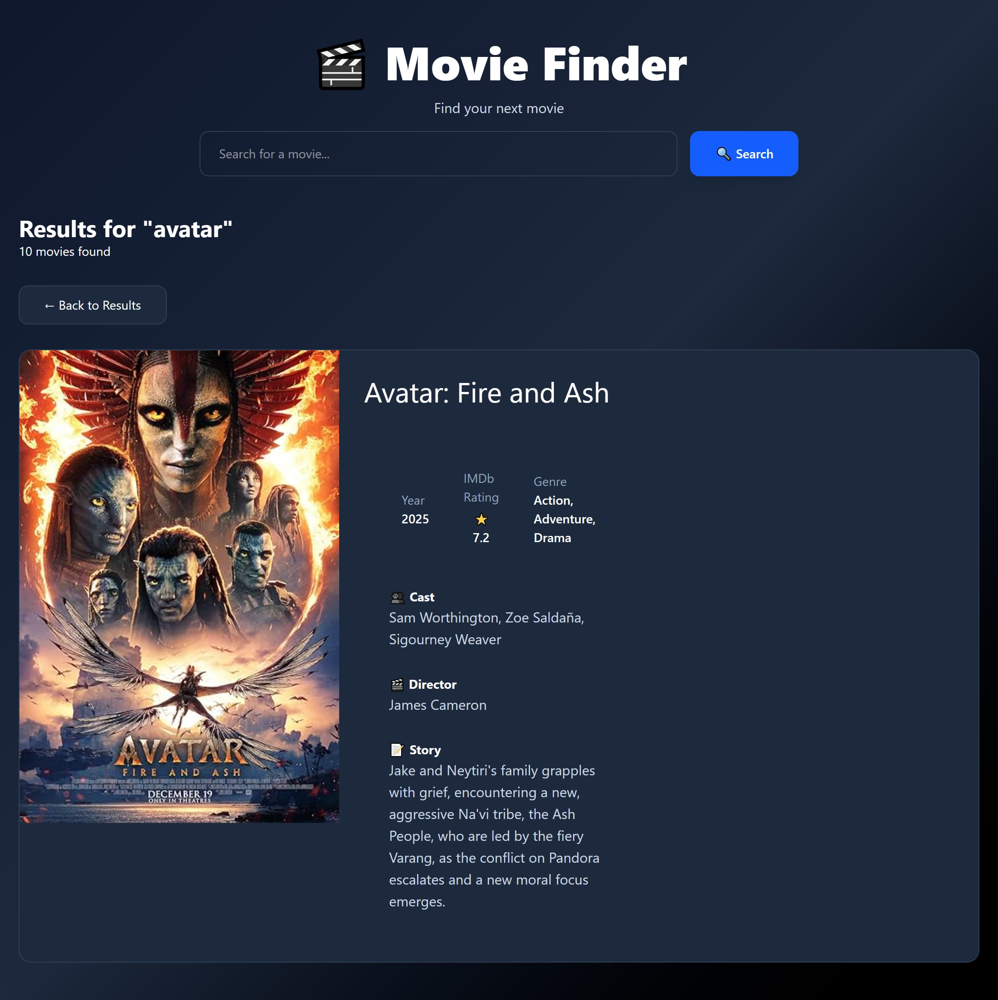

# 🎬 Movie Finder

A responsive Movie Finder web application built with HTML, Tailwind CSS and JavaScript that allow users to search for movies and view detailed information using the OMDb AP*.

##  Features

* Search for movies by title
* Display movie posters in a responsive grid
* View detailed movie information including:

  * IMDb rating
  * Release year
  * Genre
  * Runtime
  * Director
  * Cast
  * Plot summary
* Back to Results navigation
* Loading states while fetching data
* Error handling for invalid searches and network issues
* Responsive design for desktop, tablet, and mobile devices

##  Built With

* HTML5
* Tailwind CSS
* JavaScript (ES6+)
* Fetch API
* OMDb API

##  What I Learned

This project helped me strengthen my understanding of:

* Working with REST APIs
* Using the Fetch API with `async`/`await`
* Handling JSON data
* DOM manipulation
* Event listeners
* Array methods such as `forEach()` and `filter()`
* Dynamic rendering with template literals
* Error handling using `try...catch`
* Refactoring code into reusable functions
* Managing application state with JavaScript

## 📷 Screenshots

## Home page

## Search results

## Movie details

## 🔗 Live Demo

🔗 [Live Demo](https://rud-a.vercel.app/)

## 📂 Repository

🔗 [GitHub Repository](https://github.com/MorakinyoErioluwa/Movie-search.git)

## 👩🏽‍💻 Author

**Morakinyo Deborah**

Frontend Developer passionate about building clean, responsive and user-friendly web applications while continuously improving my JavaScript skills.
